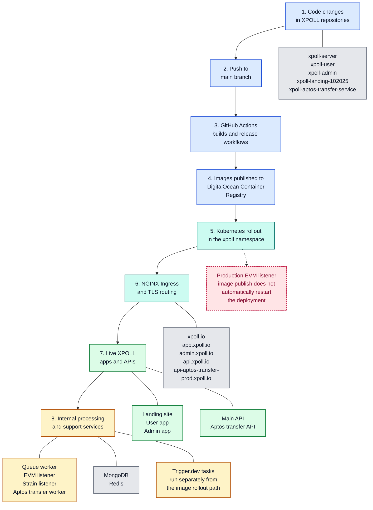

# IT-01 and IT-02 Combined Flow Diagram

This diagram shows how XPOLL moves from code changes to a live production system.

## Reading Notes

- The numbered path shows the main production journey from code change to live XPOLL system.
- The same release pattern also exists for development through the `dev` branch.
- GitHub Actions builds and publishes deployable images, and Kubernetes rolls out the updated services inside the `xpoll` namespace.
- Public websites and APIs are exposed through `NGINX Ingress` and TLS routing.
- Workers, listeners, databases, and Trigger.dev support the live platform behind the scenes, and the production EVM listener publish path does not automatically restart its deployment.
