# IT-01 and IT-02 Combined Flow Diagram

This diagram combines XPOLL platform delivery, deployment, ingress, and runtime flow into a single operational view.

```mermaid
flowchart TB

subgraph platform["XPOLL Platform Delivery, Deployment, and Runtime Flow"]
  direction TB

  subgraph source_release["Source Repositories and Release Control"]
    direction LR
    xpoll_server["xpoll-server"]
    xpoll_user["xpoll-user"]
    xpoll_admin["xpoll-admin"]
    xpoll_landing["xpoll-landing-102025"]
    xpoll_aptos["xpoll-aptos-transfer-service"]
    dev_branch["dev branch<br/>(development publishes)"]
    main_branch["main branch<br/>(production publishes)"]
    gha["GitHub Actions<br/>publish workflows"]
    trigger_deploy["Trigger.dev<br/>deploy commands"]

    xpoll_server --> dev_branch
    xpoll_server --> main_branch
    xpoll_user --> dev_branch
    xpoll_user --> main_branch
    xpoll_admin --> dev_branch
    xpoll_admin --> main_branch
    xpoll_aptos --> dev_branch
    xpoll_aptos --> main_branch
    xpoll_landing --> main_branch

    dev_branch --> gha
    main_branch --> gha
    xpoll_server --> trigger_deploy
  end

  subgraph image_rollout["Image Publication and Cluster Rollout"]
    direction LR
    registry["DigitalOcean<br/>Container Registry"]
    latest_tags["latest<br/>image tags"]
    rollout["doctl and kubectl<br/>rollout restart"]
    do_cluster["DigitalOcean<br/>Kubernetes cluster"]
    xpoll_ns["xpoll namespace"]

    gha --> registry --> latest_tags --> rollout --> do_cluster --> xpoll_ns
  end

  subgraph routing["Ingress, TLS, and Public Access"]
    direction LR
    domain_root["xpoll.io<br/>www.xpoll.io"]
    domain_app["app.xpoll.io<br/>app-dev.xpoll.io"]
    domain_admin["admin.xpoll.io<br/>admin-dev.xpoll.io"]
    domain_api["api.xpoll.io<br/>api-dev.xpoll.io"]
    domain_aptos["api-aptos-transfer-prod.xpoll.io<br/>api-aptos-transfer-dev.xpoll.io"]
    tls["Wildcard TLS<br/>certificates"]
    ingress["NGINX Ingress"]

    domain_root --> ingress
    domain_app --> ingress
    domain_admin --> ingress
    domain_api --> ingress
    domain_aptos --> ingress
    tls --> ingress
  end

  subgraph runtime["XPOLL Runtime Workloads"]
    direction TB

    subgraph public_group["Public workloads"]
      direction LR
      public_anchor[" "]
      landing_site["Landing site<br/>xpoll-landing-102025"]
      user_frontend["User frontend<br/>xpoll-user-development /<br/>xpoll-user-production"]
      admin_frontend["Admin frontend<br/>xpoll-admin-development /<br/>xpoll-admin-production"]
      api_server["XPOLL API server<br/>xpoll-server-dev /<br/>xpoll-server-prod"]
      aptos_api["Aptos transfer API<br/>xpoll-aptos-transfer-server-dev /<br/>xpoll-aptos-transfer-server-prod"]

      public_anchor --> landing_site
      public_anchor --> user_frontend
      public_anchor --> admin_frontend
      public_anchor --> api_server
      public_anchor --> aptos_api
    end

    subgraph internal_group["Internal workloads"]
      direction LR
      internal_anchor[" "]
      worker["XPOLL queue worker<br/>xpoll-worker-dev /<br/>xpoll-worker-prod"]
      evm_listener["EVM listener<br/>xpoll-evm-listener-dev /<br/>xpoll-evm-listener-main"]
      strain_listener["Strain listener<br/>xpoll-strain-listener-dev /<br/>xpoll-strain-listener-main"]
      aptos_worker["Aptos transfer worker<br/>xpoll-aptos-transfer-worker-dev /<br/>xpoll-aptos-transfer-worker-prod"]

      internal_anchor --> worker
      internal_anchor --> evm_listener
      internal_anchor --> strain_listener
      internal_anchor --> aptos_worker
    end

    subgraph task_group["Task runtime"]
      direction LR
      trigger_runtime["Trigger.dev runtime"]
    end

    subgraph data_group["Data and support services"]
      direction LR
      mongo["MongoDB"]
      redis["Redis"]
    end
  end

  xpoll_ns --> public_anchor
  xpoll_ns --> internal_anchor
  xpoll_ns --> trigger_runtime

  ingress --> landing_site
  ingress --> user_frontend
  ingress --> admin_frontend
  ingress --> api_server
  ingress --> aptos_api

  api_server --> mongo
  mongo --> api_server
  api_server --> redis
  redis --> worker
  trigger_runtime --> api_server

  trigger_deploy --> trigger_runtime

  latest_tags -.-> evm_note["production publish<br/>without automatic<br/>rollout restart"]
  evm_note -.-> evm_listener
end

classDef source fill:#dbeafe,stroke:#1d4ed8,color:#0f172a,stroke-width:1.5px;
classDef release fill:#e2e8f0,stroke:#475569,color:#0f172a,stroke-width:1.5px;
classDef infra fill:#f3f4f6,stroke:#6b7280,color:#111827,stroke-width:1.5px;
classDef ingress_style fill:#ccfbf1,stroke:#0f766e,color:#0f172a,stroke-width:1.5px;
classDef public fill:#dcfce7,stroke:#15803d,color:#0f172a,stroke-width:1.5px;
classDef internal fill:#fef3c7,stroke:#b45309,color:#0f172a,stroke-width:1.5px;
classDef data fill:#e5e7eb,stroke:#4b5563,color:#111827,stroke-width:1.5px;
classDef note fill:#ffe4e6,stroke:#be123c,color:#881337,stroke-width:1.5px,stroke-dasharray: 4 2;
classDef ghost fill:transparent,stroke:transparent,color:transparent;

class xpoll_server,xpoll_user,xpoll_admin,xpoll_landing,xpoll_aptos,dev_branch,main_branch source;
class gha,trigger_deploy,registry,latest_tags,rollout release;
class do_cluster,xpoll_ns infra;
class domain_root,domain_app,domain_admin,domain_api,domain_aptos,tls,ingress ingress_style;
class landing_site,user_frontend,admin_frontend,api_server,aptos_api public;
class worker,evm_listener,strain_listener,aptos_worker,trigger_runtime internal;
class mongo,redis data;
class evm_note note;
class public_anchor,internal_anchor ghost;
```

## Reading Notes

- `dev` drives development publishes and `main` drives production publishes.
- Most workload releases publish an image and restart the matching deployment in the `xpoll` namespace.
- Trigger.dev task deployment is separate from Kubernetes image rollout.
- Only public applications and APIs are exposed through `NGINX Ingress`.
- Workers and listeners are internal-only workloads.
- The production EVM listener publish path does not include an automatic rollout restart.
